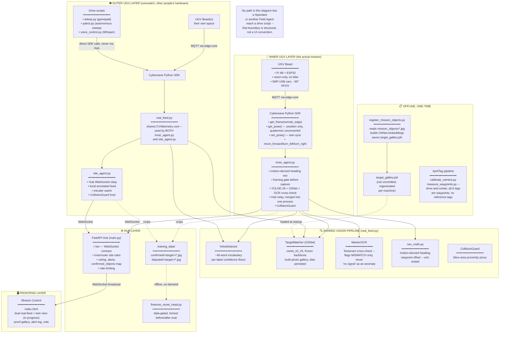
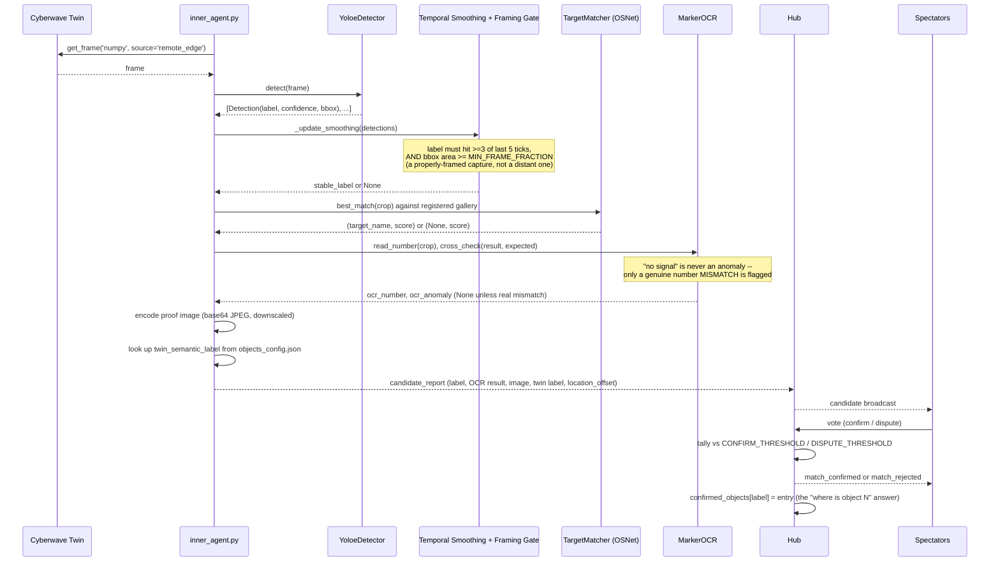
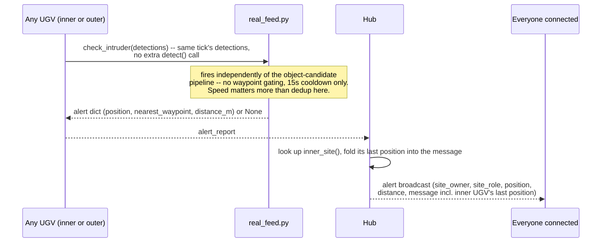
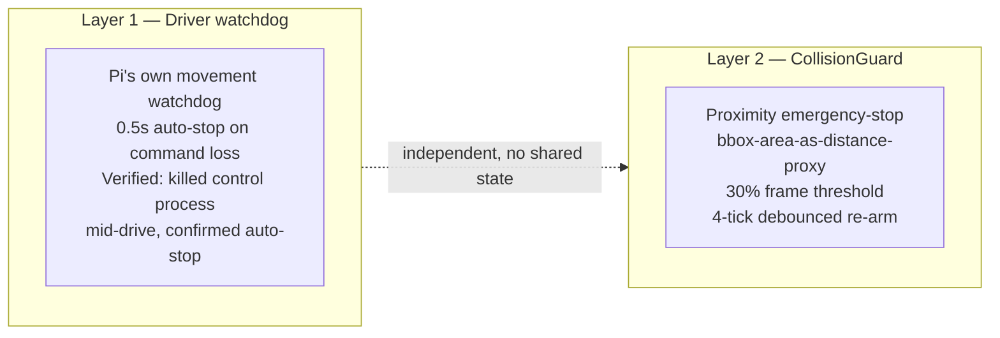

# QUARRY — System Architecture

  
  
  
  

*Part of [QUARRY](./README.md) — Cyberwave Builders Program, Cohort 2*

---

**Jump to:** [Diagram](#architecture-diagram) · [Capture Flow](#data-flow--capture-to-confirmed-object) · [Intruder Flow](#data-flow--intruder-alert) · [Components](#component-reference) · [Key Stats](#key-stats) · [Coordinate Frames](#coordinate-frames) · [Safety](#safety-architecture) · [Env Vars](#environment-variables) · [Not Solved](#whats-deliberately-not-solved)

---

## Overview

QUARRY is a co-op recon platform built on a real, named ML problem
underneath the mission framing: **human-in-the-loop verification to
reduce false positives in autonomous vision**. One INNER UGV (a real
Waveshare UGV Beast, vision-only, no lidar) runs the actual objective —
an autonomous sequential survey of 8 numbered objects. Any number of
OUTER UGVs, other people's real hardware in their own spaces, patrol as
overwatch: sharing live position with the inner UGV and raising an
immediate alert if their own vision spots an unregistered person.
Spectators watch the inner UGV's real camera feed alongside the
Cyberwave twin environment and vote only on object identity — does what
the inner UGV actually found match what the twin claims is there?
Confirmed/disputed votes feed a re-identification fine-tuning pipeline.
Two independent safety layers (driver watchdog + CollisionGuard) run
regardless of mission phase. Built for Cyberwave Builders Program,
Cohort 2.

---

## Architecture Diagram

---

## Data Flow — Capture to Confirmed Object

---

## Data Flow — Intruder Alert

---

## Component Reference

### Inner UGV

| Component | File | Purpose |
| --- | --- | --- |
| **Sequential mission driver** | `backend/inner_agent.py` | Motion-derived-heading navigation, framing-gated capture, Hub relay -- merged into one process because the mission's drive→stop→capture→verify sequencing has to live in one control loop |
| **Nav geometry** | `backend/nav_math.py` | Pure vector math (heading angle, waypoint offset) -- zero heavy dependencies, unit-tested independently of the CV/hardware stack |
| **Objects registry** | `backend/objects_registry.py` | Loads `objects_config.json`, sorts by sequence number, resolves target-name → expected-number / twin-label / description lookups |
| **Offline registration** | `backend/register_mission_objects.py` | One-time OSNet gallery build from `mission_objects/*.jpg`, run before a mission starts |

### Shared CV/Telemetry Core

| Component | File | Purpose |
| --- | --- | --- |
| **Detection** | `backend/vision/detector.py` | YOLOE-26 wrapper, open vocabulary, per-label confidence floors |
| **Re-identification** | `backend/vision/reid.py` | OSNet matcher, multi-photo gallery, **disk-persisted** (`save_gallery`/`load_gallery` -- fixes an earlier in-memory-only gap where offline registration never reached the mission-running process) |
| **OCR cross-check** | `backend/vision/ocr_check.py` | Marker-number read, flags a mismatch only -- "no signal" is never an anomaly |
| **Collision safety** | `backend/vision/collision_guard.py` | Independent proximity emergency-stop, bbox-area proxy |
| **Annotated-feed drawing** | `backend/vision/overlay.py` | Shared cube-overlay/label-coloring, used by both `inner_agent.py` and `site_agent.py` so the two don't drift into separate copies |
| **AprilTag detection** | `backend/vision/apriltag_detector.py` | tag36h11, all 8 tags are waypoints (no reserved reference tags) |
| **Waypoint measurement** | `backend/vision/measure_waypoints.py` | Drive-and-center: records `get_pose()`'s (x, y) directly at each tag, sidesteps the yaw-conversion problem entirely |
| **Live vision core** | `backend/real_feed.py` | Telemetry refresh, frame capture, temporal smoothing + framing gate, candidate lifecycle, intruder check -- shared by both inner and outer processes |

### Outer UGVs

| Component | File | Purpose |
| --- | --- | --- |
| **Relay + overwatch** | `backend/site_agent.py` | Hub relay, local annotated feed, intruder-alert reporting -- driven separately by `teleop.py`/`voice_control.py`, since outer UGVs don't need the tight sequencing inner does |
| **Alternate autonomous drive** | `backend/patrol.py` | Position-only sweep-pattern driving (no yaw guessing) -- alternative to manual `teleop.py` for outer UGVs |

### Hub Layer

| Component | File | Purpose |
| --- | --- | --- |
| **Multi-site Hub** | `backend/main.py` | WebSocket contract, inner/outer site roles, voting, alert relay, `confirmed_objects` map, chat, rate limiting |
| **Data flywheel** | `training_data/` (generated, not committed) | Confirmed/disputed crops + per-label stats |
| **Fine-tuning** | `backend/finetune_osnet_head.py` | Data-gated linear head fine-tune on frozen OSNet embeddings |

### Frontend Layer

| Component | File | Purpose |
| --- | --- | --- |
| **Mission Control** | `frontend/index.html` | Real feed + twin view (in progress), proof gallery, alert log, object-location lookup, voting |

---

## Key Stats

| Metric | Value |
| --- | --- |
| Mission objects | 8 (4 cylinders, 2 cones, 2 boxes; blue/pink marker paper) |
| Waypoints | 8, tags 0-7, all waypoints, no dedicated reference tags |
| Detection vocabulary | ~40 labels (open-vocabulary, YOLOE-26) |
| Person confidence floor | 0.65 (vs. 0.45 default) |
| Temporal smoothing window | 3 of last 5 ticks |
| Minimum frame fraction (capture gate) | 0.05 -- object must be reasonably sized in-frame before a candidate raises |
| Detection cooldown | 25s |
| Intruder-alert cooldown | 15s, no waypoint gating (speed over dedup) |
| CollisionGuard threshold | 30% of frame, 0.15s check interval |
| Re-id fine-tune data gate | ≥8 confirmed samples/class, ≥2 classes |
| Nav geometry test coverage | 13 tests (`test_nav_math.py`) |
| Object registry / OCR decision-logic test coverage | 9 tests (`test_sequential_survey_components.py`) |

---

## Coordinate Frames

Two frames matter now, one fewer than the earlier design (the AprilTag
camera-relative frame is no longer a measurement input, only an
on-screen confirmation aid -- see `measure_waypoints.py`'s docstring
for why the fusion-transform approach was rejected: it needs yaw, which
this project deliberately never derives from `get_pose()`'s quaternion):

1. **`get_pose()`'s frame** -- what `WAYPOINTS` in `real_feed.py` is
   defined in. This is now the ONLY frame that matters for waypoint
   measurement: `measure_waypoints.py` drives the robot to physically
   center on each tag, then records `get_pose()`'s (x, y) directly --
   no conversion step, because there's nothing left to convert between.
2. **Arena map frame** -- whatever the frontend's own visualization
   uses for its abstract multi-site layout, if any (has no relationship
   to real geography; exists only so each site has a stable, distinct
   position on a shared visual).

---

## Safety Architecture

`CollisionGuard` is explicitly **not** depth-based obstacle avoidance --
no lidar or depth camera on this hardware. Runs independently in both
`inner_agent.py` and `site_agent.py` -- each process starts and gates
its own movement calls behind it, so autonomous driving in either role
never runs without the emergency-stop active.

---

## Environment Variables

| Variable | Default | Purpose |
| --- | --- | --- |
| `CYBERWAVE_API_KEY` | — | Required. Cyberwave SDK authentication |
| `CYBERWAVE_ENVIRONMENT_ID` | `9383b6b2-0df7-4e99-8d9e-8a352eb6e1ab` | Twin environment |
| `GROQ_API_KEY` | — | Only needed for `voice_control.py` |

---

## Runtime Requirements — Quick Reference

Not previously called out in one place — pulled together here since it's exactly the kind of thing that trips up a fresh setup:

| Package | Role | Notes |
| --- | --- | --- |
| `ultralytics` | YOLOE-26 detection | Pulls in `torch` — GPU (CUDA) strongly recommended, degrades to detection-disabled otherwise |
| `torchreid` | OSNet re-identification | Same `torch` dependency as above; shares the GPU budget with detection |
| `pytesseract` | OCR cross-check | Python binding only — the **Tesseract binary itself** must be installed separately on the machine (not pip-installable); see `ocr_check.py`'s Windows fallback-path handling |
| `pupil-apriltags` | AprilTag detection | Needed for waypoint measurement and on-screen confirmation only, not a runtime nav dependency |
| `websockets` | Field agent ↔ Hub relay | Used by `inner_agent.py` / `site_agent.py`, distinct from FastAPI's own WebSocket handling in `main.py` |
| `groq`, `sounddevice`, `soundfile`, `keyboard` | `voice_control.py` only | Not needed unless voice control is actually used |
| `pygame` | `teleop.py` only | Gamepad input handling |

---

## What's Deliberately Not Solved

Documented here rather than left implicit:

- **Yaw from quaternion.** Never guessed, anywhere -- not in navigation,
  not in waypoint measurement. `inner_agent.py`'s nav controller and
  `measure_waypoints.py`'s drive-and-center method both work entirely
  from measured position, never rotation.
- **Remote video tunneling.** Same-machine-only by design; a real fix
  needs ngrok or equivalent, not yet built.
- **Battery/FPS telemetry.** `twin.telemetry` is publish-only; the
  correct read-side method is still unconfirmed.
- **Monocular VO.** Inherent scale ambiguity regardless of feature-
  tracking quality -- evaluated as a possible supplement, never a
  primary nav system.
- **Intruder participant-matching.** Any unregistered "person" fires an
  alert; there's no attempt to distinguish a real intruder from a known
  team member who simply isn't a registered mission object (registered
  targets are physical props, not people, so there's nothing to match
  a person's appearance against even if this were built).
- **Twin object placement reconciliation.** `objects_config.json`'s
  `twin_semantic_label` fields are still `null` for all 8 objects --
  the identity-vs-twin comparison spectators are meant to vote on
  degrades to "unknown" until this is done.

---

*Part of [QUARRY](./README.md) — Cyberwave Builders Program, Cohort 2*

*Team Fieldwork · Robot: Orion, the Outrider*

