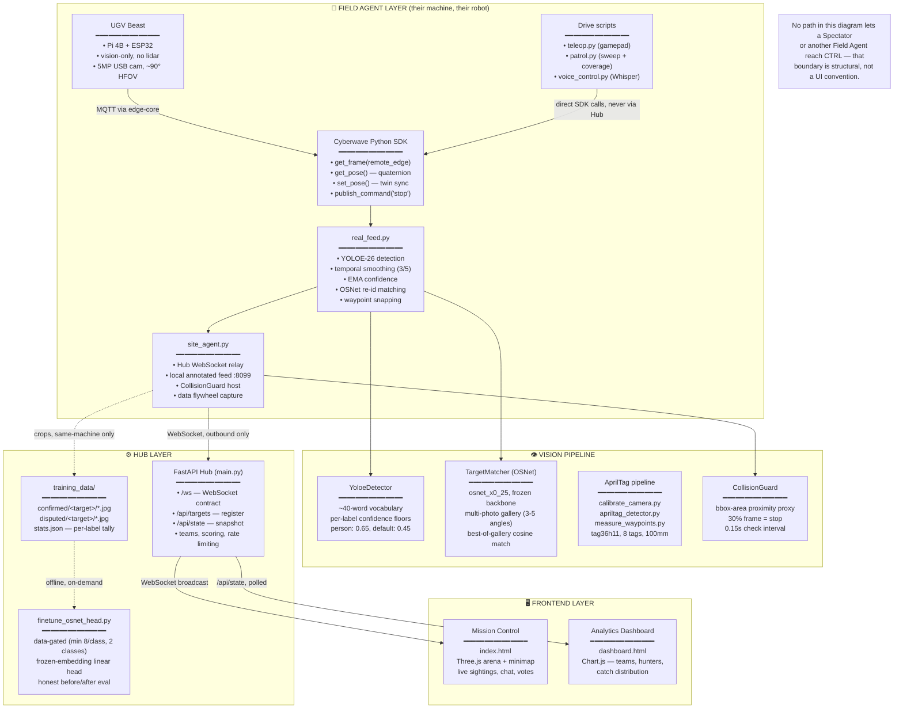
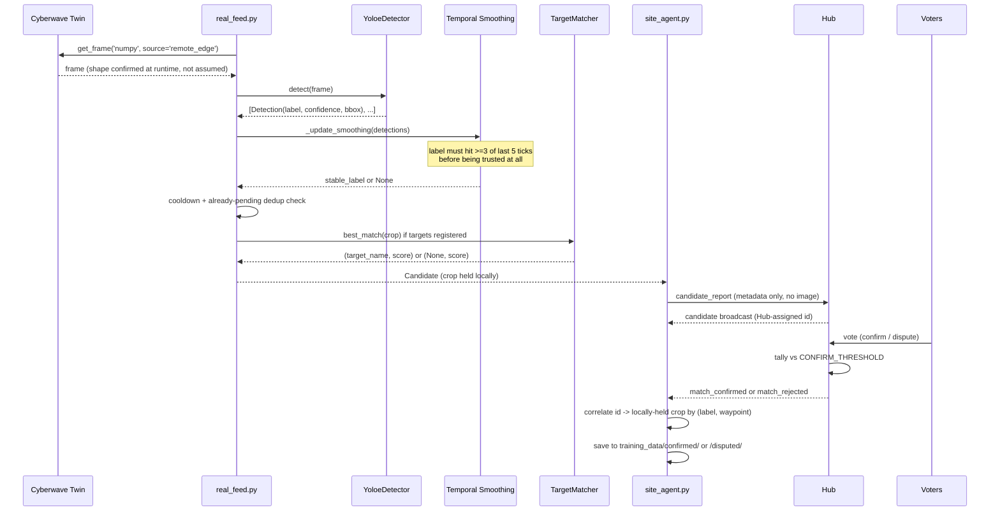
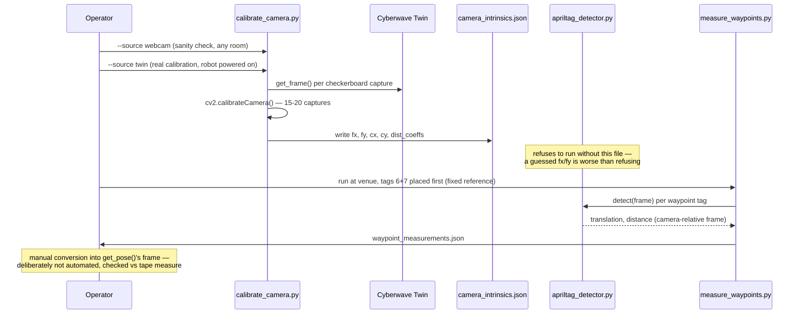
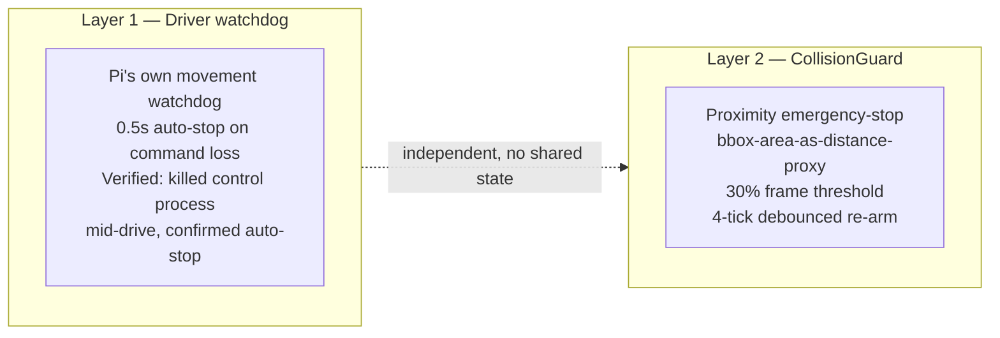

# QUARRY — System Architecture

## Overview

QUARRY is a multi-site, multiplayer autonomous target-hunting platform built on a real, named
ML problem underneath the game mechanic: **human-in-the-loop verification to reduce false
positives in autonomous vision**. Any number of Field Agents run their own Waveshare UGV Beast
(Pi 4B + ESP32, vision-only, no lidar) in their own physical space; Spectators join a shared
session with zero hardware to watch any feed and vote to confirm sightings. Every vote is a
human-verified label — the multiplayer mechanic is the incentive structure for fast,
high-quality labels, not the point of the system. YOLOE-26 does open-vocabulary detection,
OSNet does appearance-based re-identification, and confirmed/disputed votes feed a data
flywheel toward re-id fine-tuning. Two independent safety layers (driver watchdog +
CollisionGuard) run regardless of whether a match is active. Built for Cyberwave Builders
Program, Cohort 2.

---

## Architecture Diagram

---

## Data Flow — Detection to Confirmed Sighting

---

## Data Flow — AprilTag Calibration Pipeline

---

## Component Reference

### Field Agent Layer

| Component | File | Purpose |
|---|---|---|
| **Detection** | `backend/vision/detector.py` | YOLOE-26 wrapper, ~40-word open vocabulary, per-label confidence floors |
| **Re-identification** | `backend/vision/reid.py` | OSNet `osnet_x0_25`, multi-photo gallery, best-of-gallery cosine matching |
| **Collision safety** | `backend/vision/collision_guard.py` | Independent proximity emergency-stop, bbox-area proxy |
| **AprilTag calibration** | `backend/vision/calibrate_camera.py` | Checkerboard intrinsics calibration — webcam sanity check + real twin calibration |
| **AprilTag detection** | `backend/vision/apriltag_detector.py` | tag36h11 pose estimation, refuses to run without real intrinsics |
| **Venue measurement** | `backend/vision/measure_waypoints.py` | Records real waypoint positions relative to fixed reference tags |
| **Live vision core** | `backend/real_feed.py` | Telemetry refresh, frame capture, temporal smoothing, candidate lifecycle |
| **Hub relay** | `backend/site_agent.py` | WebSocket relay, local video overlay, data-flywheel crop capture |
| **Manual drive** | `backend/teleop.py` | Gamepad control, direct SDK calls |
| **Autonomous patrol** | `backend/patrol.py` | Sweep pattern + coverage tracking (not point-to-point — yaw unresolved) |
| **Voice control** | `backend/voice_control.py` | Groq Whisper push-to-talk |
| **VO experiment** | `backend/vo_feasibility_test.py` | Monocular ORB feature-tracking go/no-go signal |

### Hub Layer

| Component | File | Purpose |
|---|---|---|
| **Multi-site Hub** | `backend/main.py` | WebSocket contract, teams, scoring, voting, chat, rate limiting |
| **Data flywheel** | `training_data/` (generated, not committed) | Confirmed/disputed crops + per-label stats |
| **Fine-tuning** | `backend/finetune_osnet_head.py` | Data-gated linear head fine-tune on frozen OSNet embeddings |
| **Hub tests** | `backend/test_multisite.py` | 16 tests, real simulated WebSocket clients |

### Frontend Layer

| Component | File | Purpose |
|---|---|---|
| **Mission Control** | `frontend/index.html` | Three.js arena map + minimap, live sightings, chat, voting |
| **Analytics** | `frontend/dashboard.html` | Chart.js — team comparison, top hunters, catch distribution |

---

## Key Stats

| Metric | Value |
|---|---|
| Hub tests passing | 16 / 16 |
| Detection vocabulary | ~40 labels (open-vocabulary, YOLOE-26) |
| Person confidence floor | 0.65 (vs. 0.45 default) |
| Temporal smoothing window | 3 of last 5 ticks |
| Detection cooldown | 25s (raised from 4s after duplicate-spam bug) |
| CollisionGuard threshold | 30% of frame, 0.15s check interval |
| AprilTags printed | 8 (tag36h11, 100mm) — 6 waypoints + 2 fixed reference |
| Re-id fine-tune data gate | ≥8 confirmed samples/class, ≥2 classes |
| Multi-site robots confirmed simultaneously | 2 |
| Frontend pages | 2 (Mission Control · Analytics) |
| Camera frame shape (confirmed at runtime) | differs from driver's nominal stream resolution — always verify live, don't assume |

---

## Coordinate Frames — Three Separate Ones

A real, worth-being-explicit-about source of past confusion:

1. **`get_pose()`'s frame** — what `WAYPOINTS` in `real_feed.py` is defined in. Rotation is a
   quaternion, not yaw — deliberately unconverted rather than guessed.
2. **AprilTag camera-relative frame** — what `apriltag_detector.py` returns per detection,
   relative to the camera's own optical axis. `measure_waypoints.py` records raw values here,
   anchored to two fixed reference tags (IDs 6, 7).
3. **Arena map frame** — `_arena_position()` in `main.py`, a deterministic hash-derived position
   with **no relationship to real geography**. Exists only so every site has a stable, distinct
   spot on the shared Spectator map.

Converting frame 2 into frame 1 is manual, checked-against-a-tape-measure work —
`measure_waypoints.py` deliberately does not attempt this automatically.

---

## Safety Architecture

`CollisionGuard` is explicitly **not** depth-based obstacle avoidance — no lidar or depth camera
on this hardware, so bbox fill-fraction is a coarse proxy, described in code as an emergency
brake, not a planner. Runs independently in `real_feed.py`'s `telemetry_loop`, `site_agent.py`
(previously dead code — only ever instantiated inside `telemetry_loop`, which the multi-site
path never calls, fixed by starting it explicitly), and `patrol.py` (autonomous driving must
never run without it active).

---

## Environment Variables

| Variable | Default | Purpose |
|---|---|---|
| `CYBERWAVE_API_KEY` | — | Required. Cyberwave SDK authentication |
| `CYBERWAVE_ENVIRONMENT_ID` | `9383b6b2-0df7-4e99-8d9e-8a352eb6e1ab` | Twin environment |
| `GROQ_API_KEY` | — | Only needed for `voice_control.py` |

---

## Technology Stack

| Layer | Technology | Role |
|---|---|---|
| Robot | Waveshare UGV Beast (Pi 4B + ESP32) | Vision-only ground robot, no lidar |
| Platform | Cyberwave SDK + edge-core | Pairing, MQTT telemetry, camera frame retrieval |
| Detection | YOLOE-26 (`ultralytics`) | Real-time open-vocabulary object detection |
| Re-identification | OSNet (`torchreid`, `osnet_x0_25`) | Appearance-based re-matching + fine-tune target |
| Localization | AprilTag `tag36h11` (`pupil-apriltags`) | Waypoint pose reference |
| Calibration | OpenCV checkerboard calibration | Real camera intrinsics, not spec-sheet FOV |
| Safety | `CollisionGuard` | Independent proximity emergency-stop |
| Backend | FastAPI + WebSocket | Multi-site Hub |
| Frontend | Three.js + Chart.js + vanilla JS | Mission Control HUD + analytics |
| Voice | Groq Whisper API | Push-to-talk driving |
| ML ops | `scikit-learn` | Frozen-embedding linear head for re-id fine-tuning |
| Testing | `pytest` + FastAPI `TestClient` | 16 tests, simulated multi-client WebSocket flows |

---

## What's Deliberately Not Solved

Documented here rather than left implicit — an architecture doc that only shows what works is a
marketing document, not an architecture doc:

- **Yaw from quaternion.** Never guessed. `patrol.py` works around this with coverage-tracking
  instead of directed steering.
- **AprilTag → `get_pose()` frame conversion.** Manual, checked against physical measurement.
- **Remote video tunneling.** `site_agent.py`'s annotated feed is same-machine-only by design;
  a real fix needs ngrok or equivalent, not yet built.
- **Battery/FPS telemetry.** `twin.telemetry` is publish-only; the correct read-side method is
  still unconfirmed.
- **Monocular VO.** Has an inherent scale ambiguity regardless of feature-tracking quality —
  evaluated as a possible supplement to AprilTag gating, never a primary nav system.

---

*Part of [QUARRY](./README.md) — Cyberwave Builders Program, Cohort 2. FIELDWORK · ORION · THE OUTRIDER.*