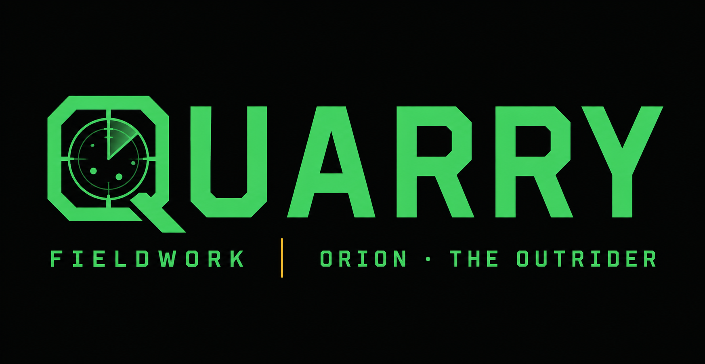
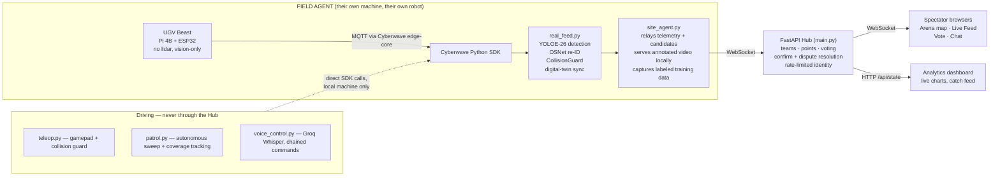

<div align="center">




</div>

<p align="center">
  
  
  
  
  
  
</p>

<p align="center">
  <strong>Cyberwave Builders Program — Cohort 2</strong><br/>
  <em>FIELDWORK · ORION · THE OUTRIDER</em>
</p>

<p align="center">
  <a href="./ARCHITECTURE.md"></a>
  <a href="#-quick-start"></a>
  <a href="#-known-limitations--what-this-honestly-cannot-do-yet"></a>
</p>

---

> *A quarry is the thing being hunted. QUARRY is a real ground robot, hunting real targets registered before the round starts — with a team behind it, watching, voting, and calling the shots.*

## What It Is

QUARRY started as a single-robot target-hunting demo and grew into a **multi-site hub**: any number of Field Agents, each with their own real UGV in their own physical space, patrol independently while Spectators join a shared session to watch any agent's live feed, vote to confirm sightings, and push their team up a shared leaderboard. Nobody ever drives another person's robot — that boundary is enforced in the architecture, not just the UI.

**Core loop:** a UGV (Waveshare UGV Beast, no lidar, vision-only) patrols on a Raspberry Pi, streaming telemetry and camera frames to a companion laptop. The laptop runs real-time open-vocabulary detection (YOLOE-26) plus appearance-based re-identification (OSNet) to recognize registered targets even after they change appearance. Confirmed sightings — voted on by the team, not auto-accepted — score real points onto a team leaderboard. Disputed sightings resolve too, symmetrically, and feed a labeled dataset for future re-id improvement (see [Data Flywheel](#-the-data-flywheel) below).

---

## What Actually Works Right Now

| Capability | Status |
|---|---|
| Cyberwave pairing, live WebRTC video (30fps) | ✅ Verified on real hardware |
| **CV detection against real live objects** | ✅ **Confirmed live** — YOLOE-26 boxes (person, chair, table, bag, etc.) drawn on real camera frames, color-coded per label |
| **Two real robots, same session, simultaneously** | ✅ **Confirmed live** — two independent Field Agents patrolling their own spaces, both feeding the same multi-site Hub, a Spectator switching between both feeds |
| **Digital twin position sync to the Cyberwave platform** | ✅ **Confirmed live** — robot marker visibly moves in the Cyberwave platform's own twin view while driving |
| Manual control (gamepad teleop — drive, camera pan/tilt, lights, photo capture) | ✅ Verified on real hardware |
| **Proximity-based collision guard on both autonomous patrol and manual teleop** | ✅ Verified — persistent debounced block state, confirmed it refuses forward movement into a still-present obstacle and correctly re-arms only after real clearance |
| Independent safety watchdog (0.5s auto-stop on command loss) | ✅ Verified — killed the control process mid-drive, confirmed auto-stop |
| Multi-site Hub (teams, points, voting, dispute rejection, rate-limited anti-spam identity) | ✅ 16/16 automated tests passing, plus confirmed live multiplayer sessions |
| **Live analytics dashboard** (team comparison, top hunters, confirmed-catch feed, catch-value distribution) | ✅ Confirmed live, pulls from `/api/state` every 4s |
| **Multi-photo target registration** (3–5 angles per target, best-match-across-gallery) | ✅ Confirmed live |
| **Voice control** — chained commands ("forward then right"), Whisper transcription with vocabulary-biased prompting | ✅ Confirmed live |
| Autonomous patrol — drive-and-scan sweep with real coverage tracking | ✅ Confirmed live (see [Known Limitations](#-known-limitations--what-this-honestly-cannot-do-yet) for what this isn't yet) |
| AprilTag-based waypoint localization | ⏳ Tags generated, not yet physically placed — see Known Limitations |

---

## Architecture



See [`ARCHITECTURE.md`](./ARCHITECTURE.md) for the full WebSocket message contract and sequence flows.

---

## The Data Flywheel

Every vote your team casts during a hunt is a human-verified label:

- **Confirmed** sightings → the cropped detection is saved to `training_data/confirmed/<label>/`
- **Disputed** sightings → saved to `training_data/disputed/<label>/` as a hard negative
- A running per-label confirm/dispute tally lives in `training_data/stats.json` — a real evaluation metric grounded in live gameplay, not an offline benchmark

Nobody does anything extra to generate this — it's a byproduct of the multiplayer voting mechanic that already has to happen for scoring. No other submission in this cohort turns its multiplayer layer into a training-data pipeline for free. Once real volume accumulates across a few hunts, this dataset is the input for fine-tuning OSNet's classification head on the RTX 4050 — deliberately not done yet, since fine-tuning against a handful of images would be worse than not fine-tuning at all.

---

## Screenshots

| | |
|---|---|
|  |  |
| *Two real robots, two Field Agents, one shared Hub — confirmed live* | *YOLOE-26 detection on a real camera frame, color-coded per label* |
|  |  |
| *The Cyberwave platform's own twin view, moving in sync with the physical robot* | *Team comparison, top hunters, and confirmed-catch feed, updating live* |

*(drop your own screenshots into `docs/screenshots/` with these filenames, or update the paths above)*

---

## Tech Stack

| Layer | Technology | Role |
|---|---|---|
| Robot | Waveshare UGV Beast (Pi 4B + ESP32) | Vision-only ground robot, no lidar |
| Platform | Cyberwave SDK + edge-core | Pairing, MQTT telemetry, WebRTC video, digital-twin position sync |
| Detection | YOLOE-26 (via `ultralytics`) | Real-time open-vocabulary object detection, expanded vocabulary + per-label confidence floors |
| Re-identification | OSNet (`torchreid`, `osnet_x0_25`) | Appearance-based target re-matching, multi-photo gallery per target |
| Safety | `CollisionGuard` | Independent proximity-based emergency stop, wired into both autonomous patrol and manual teleop |
| Backend | FastAPI + WebSocket | Multi-site Hub — teams, scoring, voting (confirm + dispute), chat |
| Frontend | Three.js (arena map) + vanilla JS | Single-screen tactical HUD, live analytics dashboard |
| Voice | Groq Whisper API | Push-to-talk driving, chained multi-command parsing |
| Data | Local crop capture | Confirm/dispute-labeled training data for future re-id fine-tuning |
| Testing | `pytest` + FastAPI `TestClient` | 16 tests, simulated multi-client WebSocket flows |

---

## Project Structure

```
quarry/
├── backend/
│   ├── main.py              FastAPI Hub — multi-site WebSocket contract, teams, scoring, dispute resolution
│   ├── mock_feed.py          Legacy single-robot simulated feed (dev reference)
│   ├── real_feed.py          Live telemetry + YOLOE-26/OSNet detection, digital-twin sync, candidate raising
│   ├── site_agent.py         Relays a Field Agent's own robot into the Hub, local video overlay, training-data capture
│   ├── teleop.py             Gamepad driving + persistent collision guard
│   ├── patrol.py             Autonomous drive-and-scan sweep with coverage tracking
│   ├── voice_control.py      Push-to-talk driving via Groq Whisper, chained commands
│   ├── test_multisite.py     16 tests — Hub contract verified with simulated WebSocket clients
│   └── vision/
│       ├── detector.py       YOLOE-26 wrapper, expanded vocabulary, per-label confidence floors
│       ├── reid.py           OSNet appearance matcher, multi-photo gallery
│       └── collision_guard.py  Independent proximity emergency-stop, debounced persistent state
├── frontend/
│   ├── index.html            Single-screen HUD (inline styles/scripts) — arena, live feed, sightings, chat, registration
│   ├── dashboard.html        Live analytics dashboard (inline styles/scripts) — Chart.js team/hunter/catch charts
│   └── js/
│       └── map3d.js          Legacy single-robot waypoint map (superseded by the inline multi-site arena in index.html)
├── training_data/            Confirm/dispute-labeled crops + stats.json (gitignored, generated at runtime)
├── find-quarry.ps1           Auto-detects current subnet and locates the Pi (mDNS is unreliable on phone hotspots)
├── requirements.txt
└── .gitignore
```

---

## Quick Start

### 1. Clone & install

```bash
git clone https://github.com/ashish-doing/Quarry.git
cd Quarry
python -m venv venv
.\venv\Scripts\Activate.ps1        # Windows
pip install -r requirements.txt
```

### 2. Configure

```bash
# .env (never committed — see .gitignore)
CYBERWAVE_API_KEY=your_key_here
CYBERWAVE_ENVIRONMENT_ID=your_environment_id
GROQ_API_KEY=your_key_here          # only needed for voice_control.py
```

### 3. Run the Hub

```bash
uvicorn backend.main:app --port 8001
```

Open `http://127.0.0.1:8001` — join as a Spectator, or as a Field Agent if you have your own paired robot. Click **ANALYTICS →** in the top bar to open the live dashboard in a separate tab without losing your session.

### 4. Connect your robot (Field Agent only)

```bash
python -m backend.site_agent --hub ws://127.0.0.1:8001/ws --name "YourName" --location "City, Country" --team Alpha
```

Run this from a second machine (or a second terminal, different callsign) to confirm the multi-site path with two real robots at once.

### 5. Drive it — pick one

```bash
python -m backend.teleop             # gamepad, with proximity collision guard
python -m backend.patrol             # autonomous sweep, with coverage tracking
python -m backend.voice_control      # push-to-talk (hold SPACE), chained commands supported
```

**Never run more than one of `teleop.py` / `patrol.py` / `voice_control.py` at the same time** — each is a full control path to the same robot. Run each with `python -m backend.<name>` from the project root, not `python backend\<name>.py` — the latter breaks the `from backend import real_feed` import.

### 6. Run the tests

```bash
python -m backend.test_multisite
```
16 passed — join, teams, player IDs, points-based scoring, follow-tracking, rate limiting
---

## Tests

`test_multisite.py` verifies the Hub's entire multiplayer contract with **real simulated WebSocket clients** (FastAPI `TestClient`), not mocks of the logic — join flow, team assignment, unique-name enforcement, point-based scoring off a registered target's configured value (not a flat +1), live follow-tracking ("who's watching whom"), and rate limiting under spam, all checked against the actual broadcast sequence a real client would receive.

| Check | Verifies |
|---|---|
| Join returns `init` + unique `player_id` | Every player gets a real identity, not just a name |
| Duplicate name (case-insensitive) rejected | Lightweight anti-spam — no two players share an identity |
| `site_report` / `candidate` reach spectators | Field Agent → Hub → everyone else, real broadcast |
| Vote sequence to threshold | `vote_update` → `match_confirmed` → `leaderboard` → `activity`, in order |
| Points from registered target value | A target worth 250 pts awards 250, not a flat +1 — the whole point of the scoring system |
| Team scores aggregate correctly | Team total = sum of that team's sites' scores |
| Chat broadcasts with sender identity | No anonymous actions anywhere |
| Rate limiting under spam | 8 actions / 5s per player, enforced server-side |

Dispute-resolution and the training-data flywheel are new this pass and not yet covered by automated tests — verified through live sessions instead (see [What Actually Works](#what-actually-works-right-now)).

---

## Known Limitations — What This Honestly Cannot Do Yet

- **AprilTag placement is unfinished.** Tags are generated (tag36h11, 8 tags) but not physically placed and measured. `WAYPOINTS` are still placeholder coordinates, and `WAYPOINT_SNAP_RADIUS` is still a wide-open temporary value — meaning waypoint gating is effectively cosmetic right now. This is the single biggest remaining gap in the project.
- **Autonomous patrol tracks coverage, but isn't directed path planning.** `get_pose()` returns a rotation quaternion, not a yaw angle, and that conversion was deliberately left unverified rather than guessed — guessing it wrong would mean the robot turning confidently in the wrong direction. `patrol.py` knows which waypoints it has and hasn't covered in a sweep and reports full-sweep completion, but it can't yet steer *toward* a specific unvisited one.
- **Live video in QUARRY's own dashboard is same-machine only.** A Field Agent's annotated feed is served locally (`site_agent.py`); a remote Spectator watching a different Field Agent's robot can't reach it yet — that needs a real tunnel (ngrok or similar), not yet built.
- **Battery and FPS telemetry fields are unresolved.** `twin.telemetry` turned out to be a publish-only interface, not a readable snapshot — the correct consumer-side method for these two fields hasn't been found yet. Battery currently always reports 100%.
- **The training-data flywheel captures data but doesn't train anything yet.** Confirm/dispute-labeled crops accumulate correctly, but fine-tuning OSNet on them is a deliberate follow-up, sequenced after real volume exists — not attempted against a near-empty dataset.
- **Digital-twin position sync calls a real, confirmed SDK method (`set_pose`), but that method's own docstring flags it as a stub as of this SDK version.** It's verified working by watching the platform view move live — worth re-confirming if the SDK version changes.

Every one of these is a known, named gap — not a hidden one. This list gets shorter as each is resolved, not quietly removed.

---

## Safety Design

- Every drive path (`teleop.py`, `patrol.py`, `voice_control.py`) runs **locally, on the Field Agent's own machine**, calling the Cyberwave SDK directly — never routed through the multiplayer Hub. No Spectator, and no other Field Agent, can ever send a movement command to someone else's robot, under any UI framing.
- **Two independent safety layers**, not one: the Pi's own driver-level movement watchdog (0.5s auto-stop if commands stop arriving, verified by killing the controlling process mid-drive) and `CollisionGuard` (proximity-based emergency stop using detection bbox size as a distance proxy — deliberately described as a coarse "something is right in front of the camera, stop now" reflex, not real depth-based obstacle avoidance, since this hardware has no lidar or depth camera).
- `CollisionGuard`'s block state is **persistent and debounced**, in both the autonomous patrol path and manual teleop: a single clear frame does not re-arm forward movement. It takes several consecutive clean reads in a row before the robot is allowed to move forward again — confirmed live that a lone flaky detection can't let the robot slip back into an obstacle that's still there.
- Every safety trigger — collision stop, re-arm — is surfaced live in the multiplayer Activity feed, not just a terminal log, so a Spectator can see the safety layer working in real time.

---

## Author

**Ashish Kumar** — B.Tech ECE, IIIT Guwahati (Batch 2024)

[](https://github.com/ashish-doing)
[](https://linkedin.com/in/ashish-kumar-014aaa3b9)
[](https://huggingface.co/ashish-doing)

---

## License

MIT — see [LICENSE](LICENSE) for details.

---

<div align="center">

Built for the **Cyberwave Builders Program — Cohort 2**

*FIELDWORK · ORION · THE OUTRIDER*

*Every hunt needs a team behind it.*

</div>