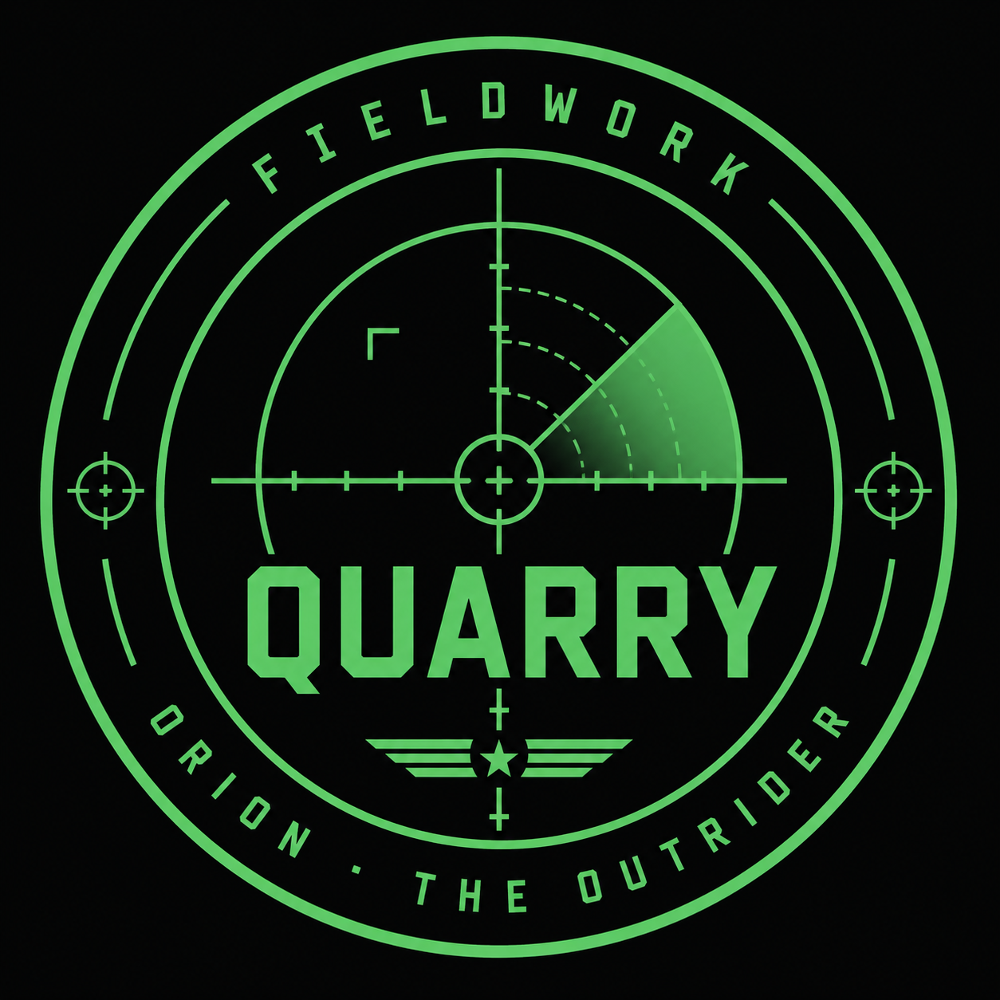
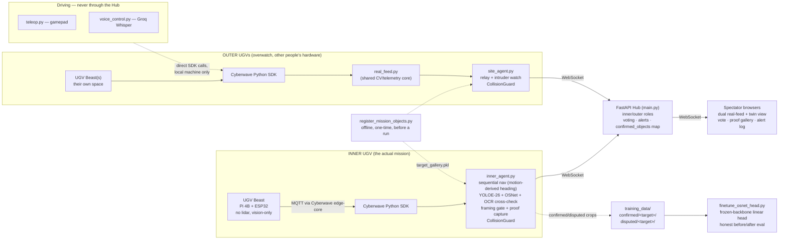

<div align="center">




</div>

<div align="center">

[](./ARCHITECTURE.md)
[](#quick-start)
[](#known-limitations--what-this-honestly-cannot-do-yet)
[](#tech-stack)
[](#tech-stack)

</div>

<p align="center">
  <strong>Cyberwave Builders Program — Cohort 2</strong><br/>
  Robot: <strong>Orion, the Outrider</strong> &nbsp;·&nbsp; Team: <strong>Fieldwork</strong>
</p>

<p align="center">
  
  
  
  
  
</p>

---

> One real UGV runs the actual mission — an autonomous survey of 8 numbered objects, in order, inside a taped arena. Other real UGVs, dropped into the same Cyberwave twin from wherever they physically are, patrol as overwatch: sharing live position, watching for anyone who isn't part of the mission. A remote audience watches both the real camera feed and the twin environment side by side, and votes only on one question: does what the inner robot actually found match what the twin says lives there?

---

## 🎬 Demo Video

[](#)

> *Demo video link goes here once recorded — see [`demo_video_shot_list.md`](./demo_video_shot_list.md) for the exact shot-by-shot plan (3:00 hard cap, currently scripted to 2:50).*

---

## 📸 Screenshots

| | |
|---|---|
| *`docs/screenshots/screenshot-arena.png`* | *`docs/screenshots/screenshot-missioncontrol.png`* |
| **Taped arena, wide shot** — all 8 numbered objects visible, Orion at a waypoint | **Mission Control HUD** — live telemetry + sightings panel |
| *`docs/screenshots/screenshot-capture.png`* | *`docs/screenshots/screenshot-proofgallery.png`* |
| **Capture close-up** — object + printed marker number, readable in frame | **Proof gallery** — confirmed objects with location offset + OCR result |

> Screenshots not yet committed — see **"What photos to actually take"** below for exactly what's worth capturing for this project.

---

## What It Actually Is

Underneath the mission framing is a real, named ML problem: **human-in-the-loop verification to reduce false positives in autonomous vision** — the same architecture behind citizen-science wildlife camera-trap labeling and content-moderation triage. Every confirmed or disputed vote is a human-verified label, and confirmed/disputed crops feed a re-identification fine-tuning pipeline.

**Inner UGV** (Waveshare UGV Beast, no lidar, vision-only): drives to each of 8 waypoints in strict numeric order, using heading derived from measured position deltas — never a guessed yaw. At each waypoint it waits for a properly-framed capture, runs open-vocabulary detection (YOLOE-26) and appearance re-identification (OSNet) to confirm which registered object it's looking at, cross-checks that identity against an independent OCR read of the object's printed marker number, and logs the object's location as an offset from its nearest known waypoint. The captured photo, OSNet match, OCR result, and what the Cyberwave twin claims is at that location are all sent to the shared session.

**Outer UGVs** (anyone else's real hardware, their own space): don't run the numbered-object sequence. They patrol their own area, share live position with the inner UGV through the Hub, and raise an immediate alert — position, distance to nearest waypoint, a short message — the moment their own vision spots an unregistered person nearby. No voting on alerts; speed matters more than consensus there.

**Spectators**: watch the inner UGV's real camera feed and the Cyberwave twin view together, and confirm or dispute each captured object's identity — does the real captured object (label + OCR-read number) actually match what the twin describes at that location? Confirmed objects build a running map that answers "where is object 2" as a lookup, not a live query.

---

## What Actually Works Right Now

| Capability | Status |
| --- | --- |
| Cyberwave pairing, live camera frame retrieval (`get_frame(source='remote_edge')`) | ✅ Confirmed |
| Manual control (gamepad teleop — drive, camera pan/tilt, lights, photo capture) | ✅ Verified on real hardware |
| Two independent safety layers (0.5s driver watchdog + `CollisionGuard`) | ✅ Verified |
| CV detection pipeline (YOLOE-26 + OSNet), temporal smoothing, EMA confidence | ✅ Confirmed against real live frames |
| Capture framing gate (won't raise a candidate until the object is well-framed, not just barely visible) | ✅ Built |
| OCR cross-check against OSNet's match (Tesseract) | ✅ Built — flags mismatches only, never flags "no signal" as an anomaly |
| Sequential nav controller (`inner_agent.py`) — motion-derived heading, no quaternion guessing | ✅ Built, unit-tested (`test_nav_math.py`) |
| Intruder alert (unregistered "person" detection → immediate broadcast with position) | ✅ Built, both inner and outer UGVs |
| Multi-site Hub (inner/outer roles, voting, rate-limited anti-spam identity) | ✅ Built |
| Image-bearing proof gallery (captured photo + OCR + twin-label comparison, one place at end of patrol) | ✅ Built |
| Offline multi-photo object registration + OSNet gallery persistence (`register_mission_objects.py`) | ✅ Built — fixes an earlier in-memory-only gap |
| Digital twin position sync (`set_pose()`) | ✅ Confirmed visibly moving in Cyberwave's own twin view |
| Data flywheel capture (confirmed/disputed crops → `training_data/`) | ✅ Wired end-to-end |
| AprilTag waypoint measurement (drive-and-center, all 8 tags as waypoints) | ⏳ Code complete, not yet run at the venue |
| OSNet head fine-tuning | ⏳ Script complete, blocked on real training data volume |
| Monocular VO feasibility | ⏳ Test script complete, not yet run |
| Dual real-feed + twin-view spectator panel | ⏳ Frontend work in progress, blocked on confirming what the Cyberwave twin viewer actually renders |

---

## Architecture



See [`ARCHITECTURE.md`](./ARCHITECTURE.md) for the full WebSocket message contract, sequence flows, and coordinate-frame notes.

---

## The Data Flywheel & Fine-Tuning

Every vote is a labeled example, not a throwaway UI interaction:

1. `inner_agent.py`/`site_agent.py` raises a candidate → crop is held locally.
2. Spectators vote confirm/dispute. The relay process correlates the Hub's broadcast candidate ID back to the locally-held crop by matching `(label, waypoint)`.
3. The crop is saved to `training_data/confirmed/<target>/` or `training_data/disputed/<target>/` — a running per-label tally is kept in `training_data/stats.json`.
4. `finetune_osnet_head.py` trains a linear classification head on top of the frozen OSNet backbone, evaluated against a held-out split, reported honestly alongside sample counts.

**Current state, honestly:** the pipeline is built and its data-volume gate refuses to run on insufficient data. It has not yet been run against real training data from an actual mission session.

---

## Tech Stack

| Layer | Technology | Role |
| --- | --- | --- |
| Robot | Waveshare UGV Beast (Pi 4B + ESP32) | Vision-only ground robot, no lidar |
| Platform | Cyberwave SDK + edge-core | Pairing, MQTT telemetry, camera frame retrieval, shared twin |
| Detection | YOLOE-26 (`ultralytics`) | Real-time open-vocabulary object detection |
| Re-identification | OSNet (`torchreid`, `osnet_x0_25`) | Appearance-based target re-matching, persisted gallery |
| Identity cross-check | Tesseract (`pytesseract`) | OCR read of printed marker numbers |
| Navigation | Motion-derived heading (`nav_math.py`) | Closed-loop, measured — never a guessed yaw |
| Localization | AprilTag (`tag36h11`, `pupil-apriltags`) | Waypoint measurement, drive-and-center method |
| Safety | `CollisionGuard` + driver watchdog | Two independent layers |
| Backend | FastAPI + WebSocket | Multi-site Hub — inner/outer roles, voting, alerts |
| Voice | Groq Whisper API | Push-to-talk driving commands |
| ML ops | `scikit-learn` | Frozen-embedding linear head for re-id fine-tuning |
| Testing | `pytest` | Nav math, object registry, OCR decision logic, Hub contract |

---

## Project Structure

```
quarry/
├── backend/
│   ├── main.py                       FastAPI Hub — inner/outer roles, voting, alerts, confirmed_objects map
│   ├── mock_feed.py                  Legacy single-robot simulated feed (dev reference)
│   ├── real_feed.py                  Shared CV/telemetry core -- used by both inner_agent.py and site_agent.py
│   ├── inner_agent.py                Inner UGV: sequential nav + capture + relay, merged into one process
│   ├── site_agent.py                 Outer UGV: relay + intruder watch (driven separately by teleop.py)
│   ├── patrol.py                     Outer UGV: alternate autonomous sweep-drive script (position-only, no yaw)
│   ├── nav_math.py                   Pure geometry for the nav controller — unit-tested, zero heavy deps
│   ├── objects_registry.py           Loads/reconciles objects_config.json
│   ├── objects_config.json           The 8 mission objects (number, target_name, waypoint, twin label, description)
│   ├── register_mission_objects.py   Offline, one-time OSNet gallery registration -- run before a mission
│   ├── teleop.py                     Gamepad driving (outer UGVs, or inner if not using inner_agent.py's own loop)
│   ├── voice_control.py              Push-to-talk driving via Groq Whisper
│   ├── finetune_osnet_head.py        Re-id fine-tuning — data-gated, honest before/after eval
│   ├── vo_feasibility_test.py        Monocular VO go/no-go experiment
│   ├── test_multisite.py             Hub contract tests
│   ├── test_dispute_and_safety_edge_cases.py
│   ├── test_nav_math.py              Nav geometry tests
│   ├── test_sequential_survey_components.py  Object registry + OCR decision-logic tests
│   └── vision/
│       ├── detector.py               YOLOE-26 wrapper, per-label confidence floors
│       ├── reid.py                   OSNet appearance matcher, multi-photo gallery, disk persistence
│       ├── ocr_check.py              Marker-number OCR cross-check
│       ├── collision_guard.py        Independent proximity emergency-stop
│       ├── overlay.py                Shared annotated-feed drawing (cube overlay, label colors)
│       ├── apriltag_detector.py      AprilTag pose estimation — 8 tags, all waypoints, no reference tags
│       ├── calibrate_camera.py       One-time camera intrinsics calibration
│       └── measure_waypoints.py      Venue tool — drive-and-center waypoint measurement via get_pose()
├── mission_objects/                  Photos for register_mission_objects.py (object-01/ ... object-08/) -- not committed
├── target_gallery.pkl                Generated OSNet gallery -- not committed, regenerate via register_mission_objects.py
├── frontend/
│   └── index.html                    Mission Control HUD
├── docs/
│   ├── branding/                     Logo, banner, project marks
│   └── screenshots/                  Arena, Mission Control, capture, proof gallery
├── find-quarry.ps1                   Auto-detects subnet, locates the Pi
├── requirements.txt
└── .gitignore
```

**Removed from the earlier team-hunt version:** `frontend/dashboard.html` (team leaderboard analytics), `frontend/js/map3d.js` (unused, superseded by the frontend's own inline arena rendering), and the old `sequential_patrol.py` (superseded by `inner_agent.py`, which merges driving and Hub relay into one process since the mission needs them tightly synchronized).

---

## Quick Start

### 1. Clone & install

```
git clone https://github.com/ashish-doing/Quarry.git
cd Quarry
python -m venv venv
.\venv\Scripts\Activate.ps1        # Windows
pip install -r requirements.txt
```

### 2. Configure

```
# .env (never committed — see .gitignore)
CYBERWAVE_API_KEY=your_key_here
CYBERWAVE_ENVIRONMENT_ID=your_environment_id
GROQ_API_KEY=your_key_here          # only needed for voice_control.py
```

### 3. Measure waypoints (once, at the venue)

```
python backend\vision\calibrate_camera.py --source twin
python -m backend.vision.measure_waypoints
```
Copy the resulting `x`/`y` values into `real_feed.py`'s `WAYPOINTS` list, replacing the placeholders.

### 4. Register the 8 mission objects (once, offline)

```
# mission_objects/object-01/ ... object-08/, 3-5 photos each
python -m backend.register_mission_objects
```

### 5. Run the Hub

```
uvicorn backend.main:app --port 8001
```
Open `http://127.0.0.1:8001` — join as a Spectator, or as a Field Agent (Inner or Outer role) if you have your own paired robot.

### 6. Run the inner UGV's mission

```
python -m backend.inner_agent --hub ws://127.0.0.1:8001/ws --name "Inner" --location "Room A"
```

### 7. Run an outer UGV (optional, any number)

```
python -m backend.site_agent --hub ws://127.0.0.1:8001/ws --name "Outer-1" --location "City, Country" --role outer
python backend\teleop.py    # drive it, in a separate window
# or: python backend\patrol.py    # autonomous sweep-drive alternative to manual teleop
```

**Never run more than one drive process (`teleop.py` / `patrol.py` / `voice_control.py` / `inner_agent.py`'s own loop) against the same robot at the same time.**

### 8. Run the tests

```
python -m pytest backend/ -v
```

---

## Known Limitations — What This Honestly Cannot Do Yet

- **Waypoint positions are still placeholder.** `measure_waypoints.py`'s drive-and-center method is code-complete but hasn't been run at the actual venue yet.
- **`twin_semantic_label` is `null` for all 8 objects.** The Cyberwave twin environment's actual object placement hasn't been reconciled with `objects_config.json` yet — the identity-vs-twin comparison spectators vote on will show "unknown" until this happens.
- **Dual real-feed + twin-view spectator panel isn't built.** Blocked on confirming what the Cyberwave twin viewer actually renders and how it can be embedded — a real open question, not a forgotten task.
- **OSNet fine-tuning is blocked on data volume, correctly.** No real mission session has run yet to generate the confirmed/disputed crops it needs.
- **Monocular VO is an unresolved experiment, not a feature.** Has an inherent scale ambiguity regardless of outcome; was never going to be a primary navigation system.
- **Live video is same-machine only.** A remote Spectator watching a Field Agent's robot can't reach the annotated feed yet — needs a real tunnel (ngrok or similar), not yet built.
- **The intruder alert has no participant-matching.** Any unregistered "person" detection fires an alert — it doesn't try to distinguish a genuine intruder from, say, someone briefly walking past who is actually part of the mission team but not registered as an object. Registered targets in this mission are physical props (cylinders, cones, boxes), not people, so there's no meaningful "known person" exclusion to build here.
- **`target_gallery.pkl` is version-locked to whatever torchreid/numpy produced it.** Regenerating on a different machine/environment may require re-running `register_mission_objects.py` rather than copying the pickle across.
- **Battery and FPS telemetry fields are unresolved**, same as before — `twin.telemetry` is publish-only, the correct read-side method hasn't been found.
- **Camera frame resolution differs from the driver's nominal stream setting** — confirmed during earlier sessions; any calibration or pose work should check the actual shape returned at call time.

Every one of these is a known, named gap — not a hidden one.

---

## Safety Design

- Every drive path (`teleop.py`, `voice_control.py`, `inner_agent.py`'s own driving loop) runs **locally, on that robot's own operator's machine**, calling the Cyberwave SDK directly — never routed through the Hub. No Spectator, and no other Field Agent, can ever send a movement command to someone else's robot.
- **Two independent safety layers**: the Pi's own driver-level movement watchdog (0.5s auto-stop, verified by killing the controlling process mid-drive) and `CollisionGuard` (proximity-based emergency stop using detection bbox size as a distance proxy — an explicit "something is right in front of the camera, stop now" reflex, not real depth-based obstacle avoidance, since this hardware has no lidar or depth camera).

---

## Author

<p align="center">
    img src="docs/branding/quarry-logo.png" alt="QUARRY seal" width="90" />
</p>

**Ashish Kumar** — B.Tech ECE, IIIT Guwahati (Batch 2024–2028)

[](https://github.com/ashish-doing) [](https://linkedin.com/in/ashish-kumar-014aaa3b9) [](https://huggingface.co/ashish-doing)

---

## License

MIT — see [LICENSE](./LICENSE) for details.

---

<div align="center">

Built for the **Cyberwave Builders Program — Cohort 2**

*Team Fieldwork · Robot: Orion, the Outrider*

*Every survey is a question. Only a person gets to answer it.*

</div>