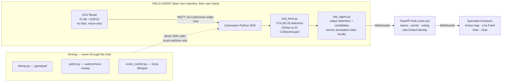

<div align="center">


</div>

<p align="center">
  
  
  
  
  
  
</p>

<p align="center">
  <strong>Cyberwave Builders Program — Cohort 2</strong><br/>
  <em>FIELDWORK · ORION · THE OUTRIDER</em>
</p>

<p align="center">
  <a href="./ARCHITECTURE.md"></a>
  <a href="#-quick-start"></a>
  <a href="#-known-limitations--what-this-honestly-cannot-do-yet"></a>
</p>

---

> *A quarry is the thing being hunted. QUARRY is a real ground robot, hunting real targets registered before the round starts — with a team behind it, watching, voting, and calling the shots.*

## What It Is

QUARRY started as a single-robot target-hunting demo and grew into a **multi-site hub**: any number of Field Agents, each with their own real UGV in their own physical space, patrol independently while Spectators join a shared session to watch any agent's live feed, vote to confirm sightings, and push their team up a shared leaderboard. Nobody ever drives another person's robot — that boundary is enforced in the architecture, not just the UI.

**Core loop:** a UGV (Waveshare UGV Beast, no lidar, vision-only) patrols on a Raspberry Pi, streaming telemetry and camera frames to a companion laptop. The laptop runs real-time open-vocabulary detection (YOLOE-26) plus appearance-based re-identification (OSNet) to recognize registered targets even after they change appearance. Confirmed sightings — voted on by the team, not auto-accepted — score real points onto a team leaderboard.

---

## What Actually Works Right Now

| Capability | Status |
|---|---|
| Cyberwave pairing, live WebRTC video (30fps) | ✅ Verified on real hardware |
| Manual control (gamepad teleop — drive, camera pan/tilt, lights, photo capture) | ✅ Verified on real hardware |
| Independent safety watchdog (0.5s auto-stop on command loss) | ✅ Verified — killed the control process mid-drive, confirmed auto-stop |
| Multi-site Hub (teams, points, voting, rate-limited anti-spam identity) | ✅ 16/16 automated tests passing |
| Real hardware → Hub relay (`site_agent.py`) | ✅ Confirmed live — first real robot successfully reporting into a multiplayer session |
| CV detection pipeline (YOLOE-26 + OSNet) loads and runs | ✅ Confirmed |
| CV detection against real live frames | ⏳ In progress — see [Known Limitations](#-known-limitations--what-this-honestly-cannot-do-yet) |
| Autonomous patrol, voice control | ✅ Built, ⏳ early real-world testing |

---

## Architecture



See [`ARCHITECTURE.md`](./ARCHITECTURE.md) for the full WebSocket message contract and sequence flows.

---

## Screenshots

| | |
|---|---|
|  |  |
| *Mission Control — single-screen HUD, no tab-switching mid-hunt* | *Arena — every connected Field Agent's site, team-colored, click to follow* |

*(drop your own screenshots into `docs/screenshots/` with these filenames, or update the paths above)*

---

## Tech Stack

| Layer | Technology | Role |
|---|---|---|
| Robot | Waveshare UGV Beast (Pi 4B + ESP32) | Vision-only ground robot, no lidar |
| Platform | Cyberwave SDK + edge-core | Pairing, MQTT telemetry, WebRTC video |
| Detection | YOLOE-26 (via `ultralytics`) | Real-time open-vocabulary object detection |
| Re-identification | OSNet (`torchreid`, `osnet_x0_25`) | Appearance-based target re-matching |
| Safety | `CollisionGuard` | Independent proximity-based emergency stop |
| Backend | FastAPI + WebSocket | Multi-site Hub — teams, scoring, voting, chat |
| Frontend | Three.js (arena map) + vanilla JS | Single-screen tactical HUD |
| Voice | Groq Whisper API | Push-to-talk driving commands |
| Testing | `pytest` + FastAPI `TestClient` | 16 tests, simulated multi-client WebSocket flows |

---

## Project Structure

```
quarry/
├── backend/
│   ├── main.py              FastAPI Hub — multi-site WebSocket contract, teams, scoring
│   ├── mock_feed.py          Legacy single-robot simulated feed (dev reference)
│   ├── real_feed.py          Live telemetry + YOLOE-26/OSNet detection, single-robot core
│   ├── site_agent.py         Relays a Field Agent's own robot into the Hub + local video overlay
│   ├── teleop.py             Gamepad driving (Xbox-style controller)
│   ├── patrol.py             Autonomous drive-and-scan sweep patrol
│   ├── voice_control.py      Push-to-talk driving via Groq Whisper
│   ├── test_multisite.py     16 tests — Hub contract verified with simulated WebSocket clients
│   └── vision/
│       ├── detector.py       YOLOE-26 wrapper, frame normalization
│       ├── reid.py           OSNet appearance matcher
│       └── collision_guard.py  Independent proximity emergency-stop
├── frontend/
│   ├── index.html            Single-screen HUD — no tabs while hunting
│   ├── css/style.css         Tactical HUD styling, corner-bracket panel framing
│   └── js/
│       ├── app.js            WebSocket client, HUD rendering, join/drop sequence
│       └── arena.js          Three.js shared arena map, team-colored site markers
├── find-quarry.ps1           Auto-detects current subnet and locates the Pi (mDNS is unreliable on phone hotspots)
├── requirements.txt
└── .gitignore
```

---

## Quick Start

### 1. Clone & install

```bash
git clone https://github.com/ashish-doing/Quarry.git
cd Quarry
python -m venv venv
.\venv\Scripts\Activate.ps1        # Windows
pip install -r requirements.txt
```

### 2. Configure

```bash
# .env (never committed — see .gitignore)
CYBERWAVE_API_KEY=your_key_here
CYBERWAVE_ENVIRONMENT_ID=your_environment_id
GROQ_API_KEY=your_key_here          # only needed for voice_control.py
```

### 3. Run the Hub

```bash
uvicorn backend.main:app --port 8001
```

Open `http://127.0.0.1:8001` — join as a Spectator, or as a Field Agent if you have your own paired robot.

### 4. Connect your robot (Field Agent only)

```bash
python -m backend.site_agent --hub ws://127.0.0.1:8001/ws --name "YourName" --location "City, Country" --team Alpha
```

### 5. Drive it — pick one

```bash
python backend\teleop.py            # gamepad
python backend\patrol.py            # autonomous sweep
python backend\voice_control.py     # push-to-talk (hold SPACE)
```

**Never run more than one of `teleop.py` / `patrol.py` / `voice_control.py` at the same time** — each is a full control path to the same robot.

### 6. Run the tests

```bash
python -m backend.test_multisite
```
```
16 passed — join, teams, player IDs, points-based scoring, follow-tracking, rate limiting
```

---

## Tests

`test_multisite.py` verifies the Hub's entire multiplayer contract with **real simulated WebSocket clients** (FastAPI `TestClient`), not mocks of the logic — join flow, team assignment, unique-name enforcement, point-based scoring off a registered target's configured value (not a flat +1), live follow-tracking ("who's watching whom"), and rate limiting under spam, all checked against the actual broadcast sequence a real client would receive.

| Check | Verifies |
|---|---|
| Join returns `init` + unique `player_id` | Every player gets a real identity, not just a name |
| Duplicate name (case-insensitive) rejected | Lightweight anti-spam — no two players share an identity |
| `site_report` / `candidate` reach spectators | Field Agent → Hub → everyone else, real broadcast |
| Vote sequence to threshold | `vote_update` → `match_confirmed` → `leaderboard` → `activity`, in order |
| Points from registered target value | A target worth 250 pts awards 250, not a flat +1 — the whole point of the scoring system |
| Team scores aggregate correctly | Team total = sum of that team's sites' scores |
| Chat broadcasts with sender identity | No anonymous actions anywhere |
| Rate limiting under spam | 8 actions / 5s per player, enforced server-side |

---

## Known Limitations — What This Honestly Cannot Do Yet

- **CV detection hasn't been confirmed against real live objects yet.** The pipeline loads and runs cleanly, and the video-overlay path is wired end to end, but the last blocking issue (finding the correct Cyberwave SDK call to pull a still frame server-side — `get_latest_frame()` and `get_frame(source='cloud')` both come back empty; `capture_frame()` works but is deprecated) is still being resolved with Cyberwave directly. Real-object detection accuracy is unverified.
- **Live video in QUARRY's own dashboard is same-machine only.** A Field Agent's annotated feed is served locally (`site_agent.py`); a remote Spectator watching a different Field Agent's robot can't reach it yet — that needs a real tunnel (ngrok or similar), not yet built.
- **Autonomous patrol is a sweep pattern, not true point-to-point navigation.** `get_pose()` returns a rotation quaternion, not a yaw angle, and that conversion was deliberately left unverified rather than guessed — guessing it wrong would mean the robot turning confidently in the wrong direction. `patrol.py` instead drives forward, checks position against waypoints, and scans when it arrives — real autonomous behavior, just not GPS-precise routing.
- **AprilTag placement is unfinished.** Tags are generated (tag36h11, 8 tags) but not physically placed and measured — `WAYPOINTS` are still placeholder coordinates.
- **Cross-account multi-robot sharing is architecturally supported but untested** — only ever run with one physical robot. Whether two different Cyberwave accounts can genuinely share a session hasn't been confirmed with a second real robot yet.
- **Voice control is built, not yet driven live.** The Groq Whisper integration hasn't had a real end-to-end test session with the robot moving.
- **Battery and FPS telemetry fields are unresolved.** `twin.telemetry` turned out to be a publish-only interface, not a readable snapshot — the correct consumer-side method for these two fields hasn't been found yet.

Every one of these is a known, named gap — not a hidden one. This list gets shorter as each is resolved, not quietly removed.

---

## Safety Design

- Every drive path (`teleop.py`, `patrol.py`, `voice_control.py`) runs **locally, on the Field Agent's own machine**, calling the Cyberwave SDK directly — never routed through the multiplayer Hub. No Spectator, and no other Field Agent, can ever send a movement command to someone else's robot, under any UI framing.
- **Two independent safety layers**, not one: the Pi's own driver-level movement watchdog (0.5s auto-stop if commands stop arriving, verified by killing the controlling process mid-drive) and `CollisionGuard` (proximity-based emergency stop using detection bbox size as a distance proxy — deliberately described as a coarse "something is right in front of the camera, stop now" reflex, not real depth-based obstacle avoidance, since this hardware has no lidar or depth camera).

---

## Author

**Ashish Kumar** — B.Tech ECE, IIIT Guwahati (Batch 2024)

[](https://github.com/ashish-doing)
[](https://linkedin.com/in/ashish-kumar-014aaa3b9)
[](https://huggingface.co/ashish-doing)

---

## License

MIT — see [LICENSE](LICENSE) for details.

---

<div align="center">

Built for the **Cyberwave Builders Program — Cohort 2**

*FIELDWORK · ORION · THE OUTRIDER*

*Every hunt needs a team behind it.*

</div>